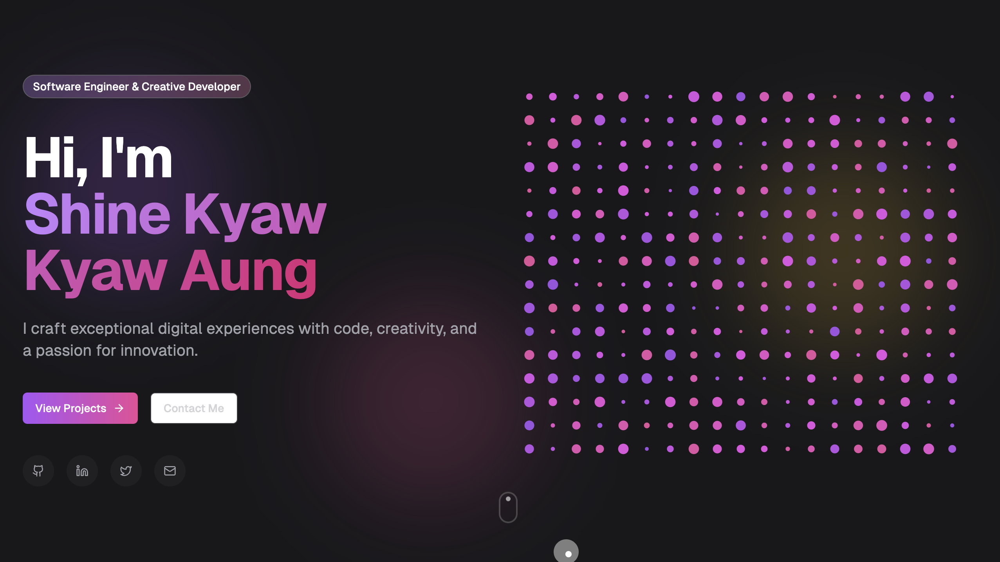

# Jeet Majumder - Portfolio

A modern, responsive developer portfolio showcasing my work in full-stack development, AI/LLM integration, and blockchain technologies.



## Tech Stack

- **Framework:** Next.js 15 (React 19)
- **Styling:** Tailwind CSS, Framer Motion
- **UI Components:** Radix UI, shadcn/ui
- **Language:** TypeScript

## Features

- Glassmorphic UI with smooth scroll animations
- Responsive design (mobile-first)
- Interactive skill badges and project showcase
- Resume download (PDF)
- Contact form
- Dark theme with gradient accents

## Skills Highlighted

JavaScript, TypeScript, React.js, Next.js, Nest.js, Node.js, React Native, Flutter, Python, Tailwind CSS, AWS, AI Integration, RAG, LLM Integration

## Getting Started

```bash
# Clone the repository
git clone https://github.com/jeet858/portfolio.git

# Install dependencies
pnpm install

# Run development server
pnpm dev
```

Open [http://localhost:3000](http://localhost:3000) to view the portfolio.

## Deployment

Deploy on Vercel:

[](https://vercel.com/new/clone?repository-url=https://github.com/jeet858/portfolio)

## License

MIT
